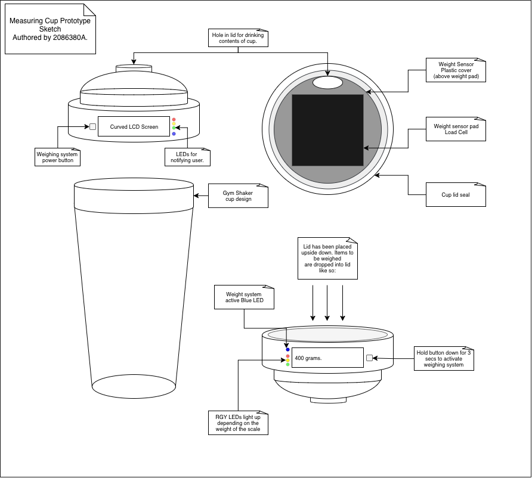
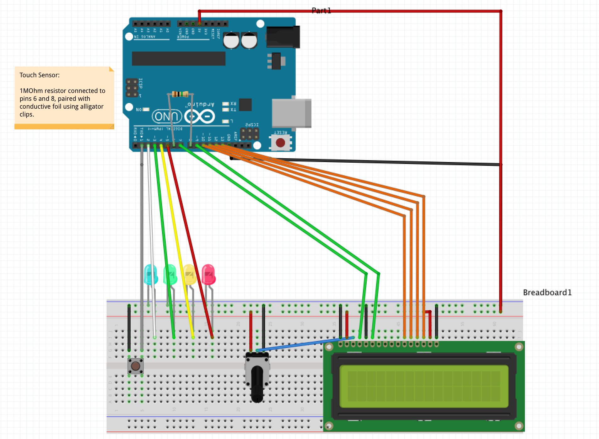
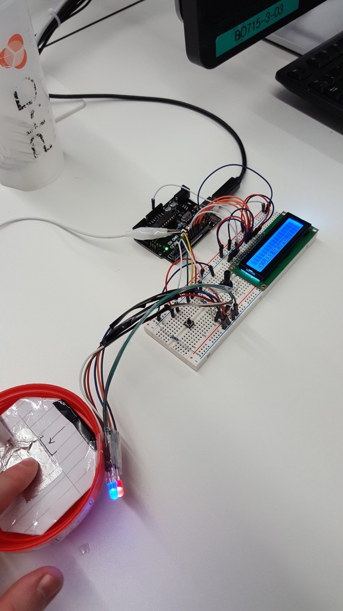

# Measure-Cup-Project

A small arduino project carried out for the Level 1 CS1Q Course at The University of Glasgow, 2017.

The aim of this project was to create a prototype and simulate the functionality of a weighing scale built into the base of a "protein shaker" style cup.

### Images

        
        

